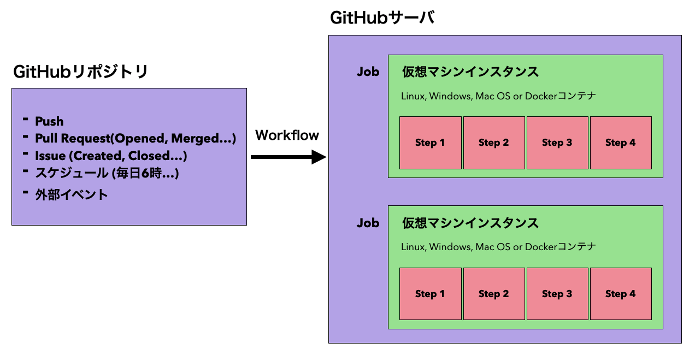

# GitHub-Actions-Study
## 概要
* GitHub上のリポジトリやイシューに対するさまざまな操作(Push, Pull Request, 外部イベントなど)や指定したスケジュールをトリガとして、あらかじめ定義した処理(Workflow)を実行する機能。

## 仕組み
* Workflow > Job > Step という単位に分けられる。
* Job毎に仮想マシンを立てることが可能。

### Runnerについて
* トリガとなるイベントが起こったときにJobを実行するためのアプリケーション。
* 標準の`GitHub-hosted Runner`(プリインストールされた仮想環境があり、curl, npmやさまざまな開発言語, Android SDK, Xcodeなどの開発キットなどが予めインストールされている)と自分でカスタマイズして実装する`Self-hosted Runner`(ハード, OS, ソフトウェアをユーザが自由にカスタマイズして管理する)がある。


## Hello World
* Workflowは`.github/workflow`直下にyml形式で定義。

```yml:helloWorld.yml
name: Hello World #ワークフローの名前

on: #ワークフロー実行のトリガーとなるイベント
  push:
    branches: 
      - main
  workflow_dispatch: #GitHub上で手動実行可能

jobs: #ワークフローで実行するジョブ(複数記述可能)
  print-hello-world: #ジョブの名前
    runs-on: macos-latest #jobを実行するVMのOSを指定
    steps: #jobの実行内容
      - name: execute echo "Hello World!"
        run: echo "Hello World!"
      - name: execute echo "Hello GitHub Actions!"
        run: echo "Hello GitHub Actions!"
```
* `main`ブランチへのpushのタイミングでワークフローが実行される。

* 実行結果の詳細も確認可能。

* `on: workflow_dispatch` 指定でGitHub上に"Run workflow"ボタンが表示され、これを押しても実行可能となる。


## execute Xcode UT on pull request
* pull requestがopenになったタイミングでXcodeprojのUTを実行し、テスト結果を表示する。

```yml:testOnPR.yml
name: Xcode UT on PR 

on:
  pull_request:
    types:
      - opened
    branches: 
      - main
  workflow_dispatch:

jobs:
  unit-test:
    runs-on: macos-latest
    steps:
      # チェックアウト
      - uses: actions/checkout@v2 # Githubやサードパーティの公開アクションを利用
      
      # UTを実行
      - name: execute UT
        run: arch -x86_64 xcrun xcodebuild -project SampleApp/SampleApp.xcodeproj/
          -scheme SampleApp
          -destination "platform=iOS Simulator,name=iPhone 13,OS=latest"
          -skip-testing:SampleAppUITests
          -resultBundlePath TestResults 
          clean test -quiet

      # テスト結果を表示
      - uses: kishikawakatsumi/xcresulttool@v1 # Xcode Result Bundleとを解析し、Markdown形式でGitHub Checks APIにPOSTして表示可能にしてくれる
        with:
          path: TestResults.xcresult
        if: success() || failure()
```
* pull reqをトリガーにWorkflowが実行される。


* 完了すると、テスト結果やCode coverageを確認できる。


## References
* [GitHub Actions ワークフロー構文](https://docs.github.com/ja/actions/using-workflows/workflow-syntax-for-github-actions)
* [【GitHub Actions】ワークフローはなんとなく書けるけど構造や仕組みの理解が曖昧な方々向けの記事](https://qiita.com/suzuki0430/items/951ed9753c04743537cc)
* [GitHub 謹製 actions](https://github.com/actions)
* [GitHub Marketplace actions](https://github.com/marketplace?type=actions)